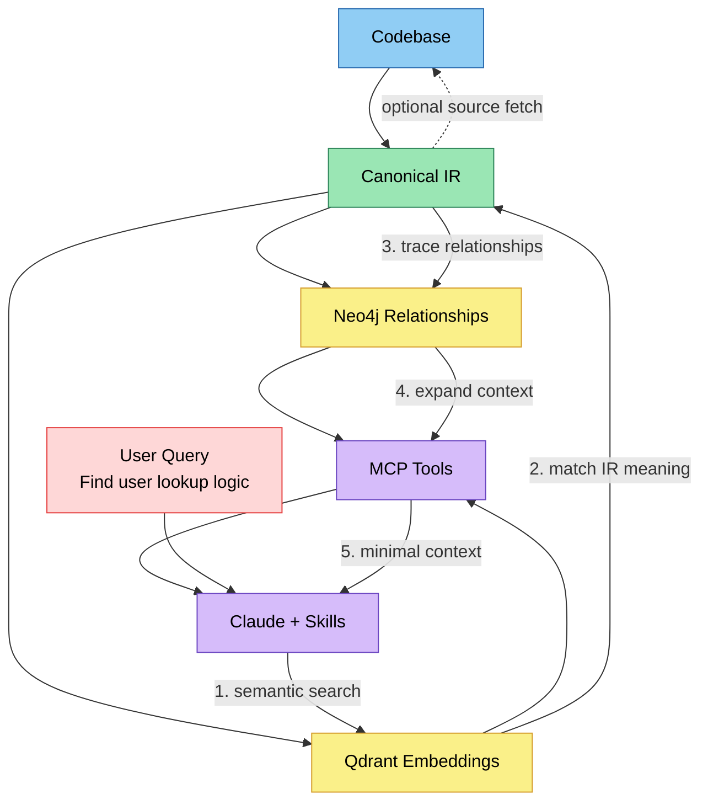
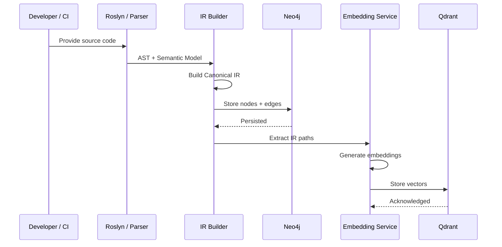
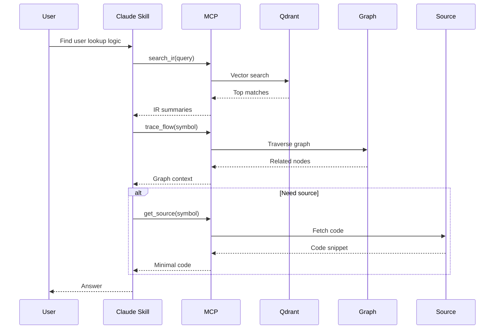
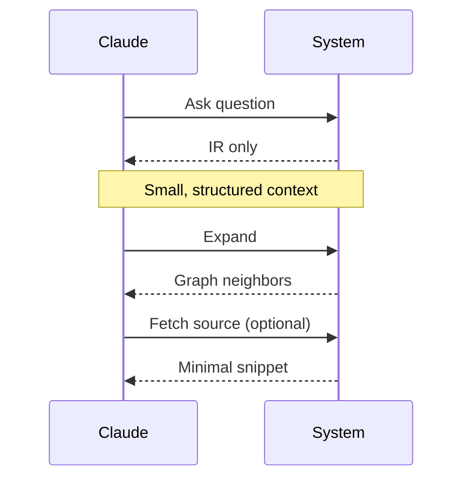

# Semantic Code Intelligence Layer

## Core Idea
Transform code from raw text into structured meaning that AI can reason over efficiently. This system turns your codebase into a queryable intelligence layer rather than a collection of files.

## Overview
The **Semantic Code Intelligence Layer** is a system that transforms source code into a structured, semantic representation that both developers and AI agents can efficiently understand and reason over.

Instead of treating code as raw text, this layer models:
- **Behavior** (via IR)
- **Relationships** (via graph)
- **Similarity** (via embeddings)

This enables AI systems (e.g., Claude) to operate on **meaning, not syntax**, improving accuracy, reducing token usage, and enabling system-level reasoning.

## Is anything similar being done? Not exactly. 
I started calling my code embedding layer code2vec back in 2008-2011, based on word2vec and seq2seq. It wasn't until 2018 that someone else named their technology code2vec and published it. That is a similar idea, in that it uses an AST to generate embeddings at the code level, which is useful at some level. But the intent there was to create meaningful function names based on what the code was actually doing. While we did look at that and we did use the AST to generate code, the idea to use embeddings was not at the code level and we would often say it was "above the code level". We were looking for the "intent of the original developer" and the "tribal knowledge" that only the original developers of the language where aware of. We wanted to pull this out of the code and felt like we could. 

## Benefits
- Faster onboarding
- Better AI-assisted development
- Reduced token usage
- Improved system understanding

## Architecture


```
Source Code
   ↓
Parsing (Roslyn / Custom Parsers)
   ↓
Canonical IR
   ↓
IR Graph
   ↓
Path Extraction
   ↓
Embedding Layer (Qdrant)
   ↓
Graph Layer (Neo4j)
   ↓
MCP Tools
   ↓
Claude + Skills
```
---

## Problem
Modern codebases are:
- Large, distributed, and difficult to understand
- Dependent on tribal knowledge
- Hard for AI tools to reason about due to limited context

Existing approaches fall short:

| Approach | Limitation |
|--|--|
| Keyword Search | Finds text, not intent |
| RAG for Code | High token cost, low structure |
| Static Analysis | Limited semantic reasoning |
| AI Copilots | Fragmented, incomplete context |

## Solution
Build a **Semantic Code Intelligence Layer** that converts code into a **queryable semantic model**.

At its core:
> Transform code from raw text → into structured meaning → accessible for reasoning.

## IR Indexing + Query Flow Sequence Diagrams 

### 1. IR Indexing Diagram



### 2. Query + Retrieval Flow (AI-Optimized)



### 3. Token-Efficient Reasoning Flow




